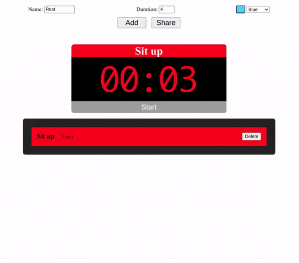

# Interval Training Timer

A draggable interval timer written in vanilla JS, HTML and CSS (watch out for the beeps). 

This project is inspired by [intervaltimer.com](https://www.intervaltimer.com/create/) and [HTML5 drag and drop API](https://developer.mozilla.org/en-US/docs/Web/API/HTML_Drag_and_Drop_API).
Special thanks to WebDevSimplified's [YouTube video](https://www.youtube.com/watch?v=jfYWwQrtzzY) & [code](https://github.com/WebDevSimplified/Drag-And-Drop) on building sortable drag & drop elements.

## Touch Screen Usage

Since [HTML5 drag and drop API](https://developer.mozilla.org/en-US/docs/Web/API/HTML_Drag_and_Drop_API) does not support touch screens, it may be harder to build a timer with such devices. It is recommended to build a timer on the computer and use the app's share URL feature to access the timer you built. Here is an [example][shareURL].

[shareURL]: https://timer.yongfu.name/?data=_LSB__LB_%22name%22_CL_%22Get%20Ready%22_CM_%22time%22_CL_%225%22_CM_%22color%22_CL_%22_PD_38cdff%22_RB__CM__LB_%22name%22_CL_%22Sit%20up%22_CM_%22time%22_CL_%2245%22_CM_%22color%22_CL_%22_PD_ff0000%22_RB__CM__LB_%22name%22_CL_%22Rest%22_CM_%22time%22_CL_%2215%22_CM_%22color%22_CL_%22_PD_00d423%22_RB__CM__LB_%22name%22_CL_%22Push%20up%22_CM_%22time%22_CL_%2245%22_CM_%22color%22_CL_%22_PD_F76B00%22_RB__CM__LB_%22name%22_CL_%22Rest%22_CM_%22time%22_CL_%2215%22_CM_%22color%22_CL_%22_PD_00d423%22_RB__CM__LB_%22name%22_CL_%22Sit%20up%22_CM_%22time%22_CL_%2245%22_CM_%22color%22_CL_%22_PD_ff0000%22_RB__CM__LB_%22name%22_CL_%22Rest%22_CM_%22time%22_CL_%2215%22_CM_%22color%22_CL_%22_PD_00d423%22_RB__CM__LB_%22name%22_CL_%22Push%20up%22_CM_%22time%22_CL_%2245%22_CM_%22color%22_CL_%22_PD_F76B00%22_RB__CM__LB_%22name%22_CL_%22Rest%22_CM_%22time%22_CL_%2215%22_CM_%22color%22_CL_%22_PD_00d423%22_RB__CM__LB_%22name%22_CL_%22Sit%20up%22_CM_%22time%22_CL_%2245%22_CM_%22color%22_CL_%22_PD_ff0000%22_RB__RSB_
